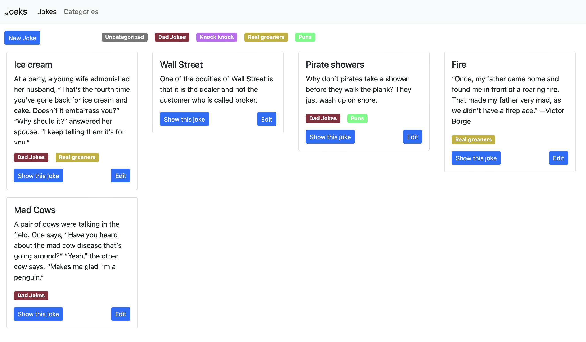
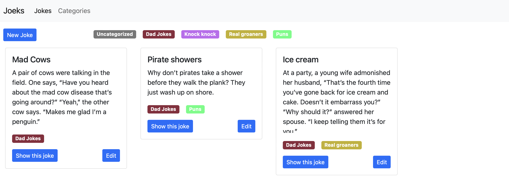
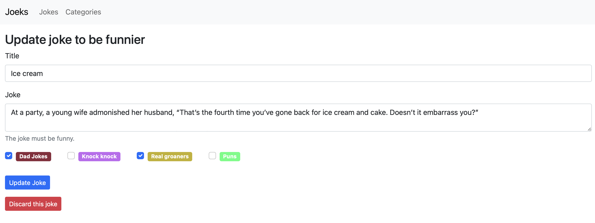
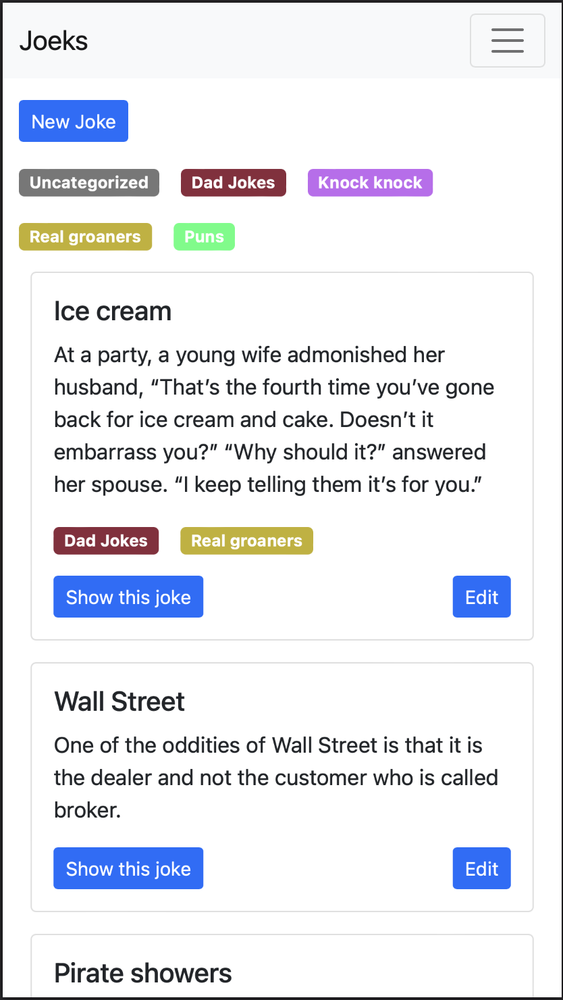
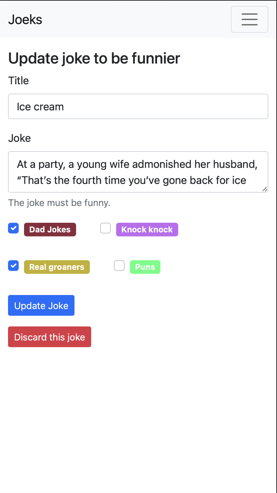

# Joeks

This is a simple Rails app I made for my self-serving purpose of saving jokes I make up on the fly.

No joke! That's all it is.

## Setup

```bash
bundle install
rails s
```

## Tech

- Rails 7
- Bootstrap
- [Discard](https://github.com/jhawthorn/discard)

## Preview

The app is simple, mobile optimized, and includes a few basic features.

See all your jokes in a long, flexible display.



Click on any categories you've created to filter down to jokes with that category.



Use the simple form to update your jokes by adding categories or tweaking the wording.



See the same info and make the same edits on mobile.




